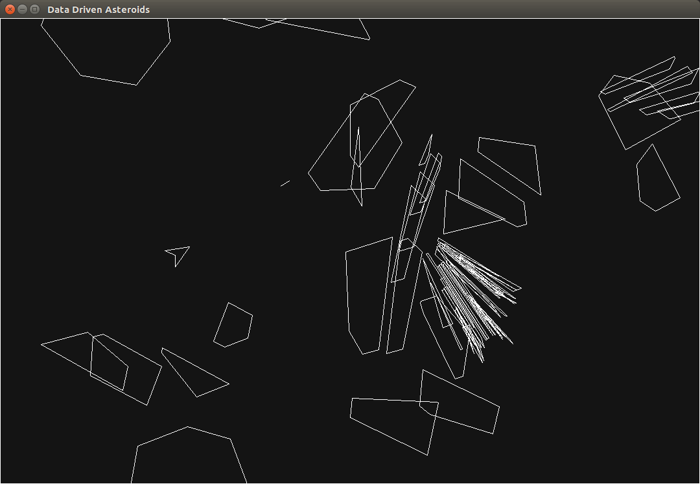
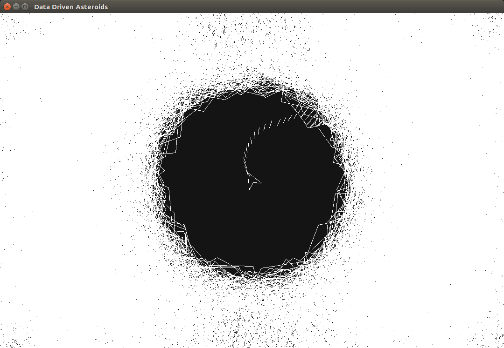

# Data Driven Asteroids

My first shot at data oriented design (DOD) which was pupularized by Mike Acton.
This is a new take of my old asteroids game by redesigning the data for cache efficient use.

## Interesting Features

* Asteroids get sliced in half when hit by a procetile (like fruit in fruit ninja) 
* Game can be recorded and looped for desired purpose (debugging or enjoyment :D).
  - by saving a snapshot of game memory and storing inputs in a circular buffer (Technique I learned from Casey Muratori's engine dev. stream).
* Game is split into a platform and game layer.
  - The game only gets its block of memory from the platform and runs, this enables the implementation of the above feature.

## Some Screenshots

* Regular Gameplay

* 10000 asteroids (60fps)

